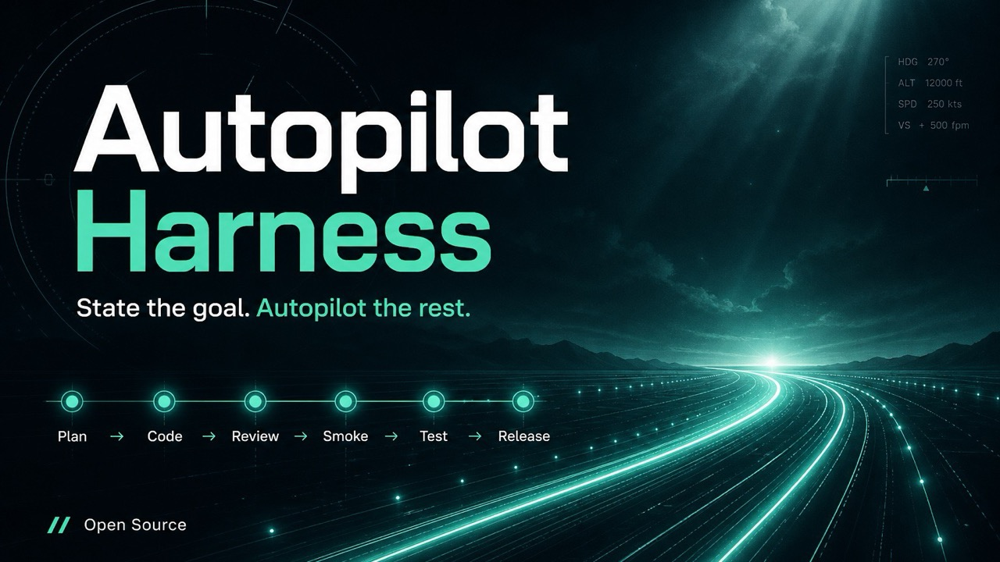

# Autopilot

**autopilot-harness** — a vibecoding harness that turns open-ended agent chat into **structured planning → checklist execution → multi-lens self-review**. ([中文说明](./README.zh-CN.md))

[](https://github.com/mt2007/autopilot-harness/actions/workflows/ci.yml)
[](./LICENSE)
[](https://nodejs.org/)

<p align="center">
  
</p>

## Why

Vibe coding is fast until scope drifts, acceptance stays implicit, and “looks done” skips hard review angles. Autopilot keeps the agent on a durable track:

1. **Grill the plan** before writing product code  
2. **Execute against a checklist** (`plans/<slug>/`)  
3. **Self-review under rotating lenses** before an item is marked done  

It is **not** a general-purpose chat agent, **not** a substitute for your CI/test framework, **not** a Jira/kanban product (checklist + execution FSM, not a board UI). **This build ships Cursor, Claude Code, Codex, Kimi Code, GitHub Copilot CLI, Grok Build CLI, Gemini CLI, Factory Droid, Hermes Agent, Antigravity, Pi, Devin CLI, and Runner (meta)** (CLI + App share one Codex port; **Kimi Code** is **degraded Stop≤1/turn**; **Copilot CLI** is **degraded Stop consecutive ≤8**; **Grok Build** is **degraded Stop ≤8/turn** — per-turn reset; **Gemini CLI** is **Shipped** with honest **AfterAgent turn cap ≤100** / `MAX_TURNS` and soft min-CLI **≥0.31.0**; **Factory Droid** is **Shipped** with **multi-block under `stop_hook_active` live-proved** — no raise; **waive live → degraded≤1**; **Hermes Agent** is **Shipped** with **shell `pre_verify` continue live-proved** — nudge ≥32; edit-only; soft min **≥0.21.3**; **waive live → degraded + human R1 ack**; **Antigravity** is **Shipped** (**host Stop continue live-proved** in **0.10.1**) — `NO_TOOL_CALL` + `transcript_full.jsonl` + **`.agents/bin` shim**; CLI must mount workspace; **Pi** is **Shipped** (**interactive TUI live Stop-continue ≥1× proved**) — in-process **`.pi/extensions/autopilot.ts`**; soft min **≥0.85.1**; **`/trust` + `/reload`**; **R10** TUI only (**not** `pi -p` / JSON / print); shares **`.agents/skills`**; outside shell `KNOWN_PLATFORMS` (eleven-way shell + Pi extension); **Runner** is **Shipped (meta)** — `runner start` external loop + `@autopilot-harness/port-runner`; requires **`runner.command`**; outside the eleven-way hook stamp set; **`--on` / `--brief` / `--message`** planning shipped (**C6** planning `stopped`→0); live agent smoke may be **waived**). **Devin CLI** is **Shipped** (**interactive CLI live Stop-continue ≥1× proved** + edit arm; **CLI only** — not Desktop, not cloud Devin, not Cascade; hooks `.devin/hooks.v1.json`; `$DEVIN_PROJECT_DIR`; skills `.devin/skills`; no documented Stop cap; shell dispatch **eleven-way**). **OpenCode** is **1 (next)** on the roadmap (wait upstream) — see [Hosts](./docs/hosts.md).

Autopilot does **not** guarantee bug-free software. It **raises confidence** that work was planned, checklist-scoped, and pressure-tested under several review lenses before you call an item complete.

## How it works

```text
/autopilot-on  →  grill rounds  →  brief / plan / checklist
       ↓
/autopilot-run →  per item: implement → fix → confirm×N → advance
       ↓
done (checklist clear)
```

| Step | You do | Autopilot does | Artifacts |
|------|--------|----------------|-----------|
| **Plan** | Start `/autopilot-on`; reply to each grill round | Writes `plans/<slug>/` (may edit docs); **no product code** | `plans/<slug>/brief.md`, `plan.md`, `checklist.md` |
| **Run** | Start `/autopilot-run` | Implements **one** checklist item | Code / docs for that item |
| **Review** | (Usually nothing — stop followups drive the loop) | Fix → confirm under rotating lenses | Item stays open until confirm rounds pass |
| **Advance** | — | Marks the item `[x]`, local commit if dirty (skip if clean; **no auto-push**), then next item | Updated `checklist.md` |
| **Done** | — | Marks the last item; local commit if dirty (**no auto-push**); stops when checklist is clear | Track complete |

Default self-review is **`review.scope: project`** (any product-code edit, no ON/RUN required). For review only during checklist RUN, set `review.scope: executing_only` — see [When does self-review run?](#when-does-self-review-run-reviewscope).

Pause, change the plan, or resume with `/autopilot-off`, `/autopilot-replan`, and `/autopilot-resume` (details in the [quickstart](./docs/autopilot/quickstart.md)).

### Author note (scale)

On one **author-run** track in **Cursor**, after `/autopilot-run`, Autopilot sustained about **351 agent turns** and about **13.9 hours of pure execution time**. That is an anecdote showing a large checklist-scoped effort can stay in a long structured loop—not a benchmark or SLA.

### Planning (grill)

`/autopilot-on` starts a design-tree grill: each round asks the current **frontier** of decisions (with recommended answers), then waits for you before the next round. Questions are numbered **globally across rounds** (`Q1`, `Q2`, … — do not restart at Q1), and each frontier is labeled with its **Round**. Planning may edit `plans/**` and docs — **no product code** until `/autopilot-run`.

Artifacts land in `plans/<slug>/brief.md`, `plan.md`, and `checklist.md`.

Planning grill rounds are inspired by the **grill-me / grilling** design-tree skill.

### Multi-lens self-review

After **product-code** edits (see below), Autopilot drives **fix**, then **confirm** rounds. Each confirm round uses a different lens (not the same checklist reread). Default `review.confirm_rounds: 5` on Cursor / Claude Code / Codex / Copilot CLI / Grok Build / Gemini CLI / Factory Droid / Hermes Agent / Antigravity / Devin CLI / Pi. When installable **Kimi Code** is enabled, use **`confirm_rounds: 1`** — that host hard-caps Stop-continue at ≤1/turn (do not expect confirm×5; init writes `1`, and the hook clamps to `1` **for the whole project**, including other hosts in the same `platforms` list). **Copilot CLI** does **not** clamp rounds but is **degraded Stop consecutive ≤8** (mid-chain cutoffs may leave pending followup — `/autopilot-resume` / nudge). **Grok Build** likewise does **not** clamp rounds but is **degraded Stop ≤8/turn** (per-turn reset; mid-cutoff → pending / RESUME / nudge). **Gemini CLI** does **not** clamp rounds; AfterAgent deny→retry shares host **`MAX_TURNS` ≤100** (no raise; prefer CLI **≥0.31.0**). **Factory Droid** does **not** clamp rounds; Stop multi-block under `stop_hook_active` is **live-proved** (no raise; **waive → degraded≤1**). **Hermes Agent** does **not** clamp rounds; shell `pre_verify` continue is **live-proved** (nudge ≥32; edit-only; if nudge still **3** / exhausted mid-chain → pending / RESUME / nudge; **waive → degraded + human R1 ack**; soft min **≥0.21.3**). **Antigravity** does **not** clamp rounds; Stop continue = `decision:continue` (**host live-proved** in 0.10.1). **Pi** does **not** clamp rounds; continue is in-process `agent_settled` (**Shipped** — live TUI continue ≥1× proved; soft min **≥0.85.1**; **R10** TUI only). With `review.confirm_rounds: 3` (light), lenses are **1 → 2 → 5** (skip concurrency & security).

A path counts as product code unless it is excluded by `.autopilotignore`, or it is **untracked and** ignored by `.gitignore`. Edits under a **paused** / OFF session do not run the chain until you resume.

| Round (default 5) | Lens |
|------:|------|
| 1 | Correctness & invariants |
| 2 | Nulls, boundaries & error paths |
| 3 | Concurrency, races & partial failure |
| 4 | Security & trust boundaries |
| 5 | Test gaps & regression (read-only: record gaps, don’t add tests in that round) |

#### When does self-review run? (`review.scope`)

Configured in `.autopilot/config.yml` under `review.scope` (chosen at `init`, changeable later):

| `review.scope` | When fix → confirm runs | Typical use |
|----------------|-------------------------|-------------|
| **`project`** (default) | On **any** product-code edit in the project — **no** `/autopilot-on` or `/autopilot-run` required | Casual coding chats; still want multi-lens pressure-test + error recover |
| **`executing_only`** | Only while Autopilot is in **RUN** (checklist executing) and product code changes | Structured tracks only: `/autopilot-on` → `/autopilot-run` → review per item |

Notes:

- **`/autopilot-on` alone does not start self-review.** Planning is for grill + `plans/<slug>/` (no product code by design). Review starts only after a **product-code** edit that counts under the scope above.
- Under **`executing_only`**, editing code outside RUN does **not** open the Autopilot fix/confirm chain.
- Under **`project`**, confirm still runs the same lenses; when you are **not** checklist-executing (idle ambient, or still **planning**), the chain ends with **review complete** (local commit if dirty) — it does **not** advance/check off checklist items. While **RUN** + executing, the same lenses still end in checklist **advance** / **done** as usual.
- **Paused** or OFF sessions do not run fix→confirm until resumed (even with `project`).
- If you also use a **global** Cursor self-review hook, prefer one or the other for `project` scope to avoid **double** followup injection (init TUI warns about this).
- Host-native **Plan modes** (Cursor Plan Mode, Claude Code Plan mode, etc.) are separate from Autopilot grill/`review.scope`; Autopilot does not yet bridge those host modes ([design sketch](./docs/host-plan-bridge.md)).

## Quick start

Requires **Node.js 22+**. The CLI package is `@autopilot-harness/cli` (bin: `autopilot-harness`).

### Install

Prefer the scoped package (not a bare `npx autopilot-harness` name). Commands use the **current working directory** as the project root:

```bash
cd /path/to/your-app
# Cursor (IDE hooks)
npx @autopilot-harness/cli init --platform cursor --yes
# or Claude Code (hooks shared across terminal + IDE)
npx @autopilot-harness/cli init --platform claude-code --yes
# or Codex (`.codex/hooks.json`; `/hooks` trust; P0 line-start triggers)
npx @autopilot-harness/cli init --platform codex --yes
# or Kimi Code (user-home `~/.kimi-code/config.toml`; degraded Stop≤1/turn; prefer confirm_rounds: 1)
npx @autopilot-harness/cli init --platform kimi-code --yes
# or GitHub Copilot CLI (`.github/hooks/autopilot-harness.json`; degraded Stop consecutive ≤8; restart CLI after install)
npx @autopilot-harness/cli init --platform copilot-cli --yes
# or Grok Build CLI (`.grok/hooks/autopilot-harness.json`; degraded Stop ≤8/turn; trust `/hooks-trust` or `--trust`)
npx @autopilot-harness/cli init --platform grok-build --yes
# or Gemini CLI (`.gemini/settings.json`; AfterAgent cap ≤100 / MAX_TURNS; prefer CLI ≥0.31.0; re-trust / `/hooks panel` / folder trust)
npx @autopilot-harness/cli init --platform gemini-cli --yes
# or Factory Droid (`.factory/hooks.json`; multi-block live-proved; `$FACTORY_PROJECT_DIR`; `/hooks` + snapshot/reload)
npx @autopilot-harness/cli init --platform factory-droid --yes
# or Hermes Agent (`$HERMES_HOME/config.yaml`; pre_verify continue live-proved; relative command; consent / `hermes hooks doctor`)
npx @autopilot-harness/cli init --platform hermes-agent --yes
# or Antigravity (`.agents/hooks.json` + `.agents/skills` + `.agents/bin` shim; Stop `decision:continue`; live-proved in 0.10.1)
npx @autopilot-harness/cli init --platform antigravity --yes
# or Pi (`.pi/extensions/autopilot.ts` in-process; soft min ≥0.85.1; `/trust`+`/reload`; R10 TUI only — not `pi -p`/JSON; shares `.agents/skills`; live continue ≥1× proved)
npx @autopilot-harness/cli init --platform pi --yes
# or Devin CLI (`.devin/hooks.v1.json` + `.devin/skills`; `$DEVIN_PROJECT_DIR`; CLI only — not Desktop; live continue ≥1× proved)
npx @autopilot-harness/cli init --platform devin --yes
# multi-host: after first init, add another without full re-init
# npx @autopilot-harness/cli init --yes --add-platform claude-code
# npx @autopilot-harness/cli init --yes --add-platform codex
# npx @autopilot-harness/cli init --yes --add-platform kimi-code
# npx @autopilot-harness/cli init --yes --add-platform copilot-cli
# npx @autopilot-harness/cli init --yes --add-platform grok-build
# npx @autopilot-harness/cli init --yes --add-platform gemini-cli
# npx @autopilot-harness/cli init --yes --add-platform factory-droid
# npx @autopilot-harness/cli init --yes --add-platform hermes-agent
# npx @autopilot-harness/cli init --yes --add-platform antigravity
# npx @autopilot-harness/cli init --yes --add-platform pi
# npx @autopilot-harness/cli init --yes --add-platform devin
npx @autopilot-harness/cli status
npx @autopilot-harness/cli doctor
```

Interactive TUI: omit `--yes` (platform still defaults to cursor). More flags: `npx @autopilot-harness/cli init --help`.

Developing or dogfooding from a clone of this repo: see [Contributing](./CONTRIBUTING.md).

Reload the host window (Cursor: Reload Window; Claude Code / Codex / Kimi Code / Copilot CLI / Grok Build / Gemini CLI / Factory Droid / Hermes Agent / Antigravity / Pi: restart / new session / `/reload`), then:

1. Plan — Cursor/Claude: `/autopilot-on`; Codex: line-start `triggers.on` (e.g. `Autopilot ON`; no Autopilot skills UI; typed slash still parses; trust `/hooks`); Kimi / Copilot / Grok: same line-start path; Gemini / Factory / Hermes / Antigravity / Pi: host skills **and** line-start (Gemini **re-trust / `/hooks panel` / folder trust**, AfterAgent **≤100**; Factory **`$FACTORY_PROJECT_DIR`** + **`/hooks` snapshot/reload**; Hermes **`$HERMES_HOME`** + consent/`hermes hooks doctor`; Antigravity **`.agents`**, `decision:continue`, live-proved continue / CLI workspace mount; Pi **`.pi/extensions`**, `/trust`+`/reload`, soft min **≥0.85.1**, **R10** TUI only) → grill → `plans/<slug>/`  
2. Execute — Cursor/Claude: `/autopilot-run`; Codex: line-start `triggers.run` (e.g. `Autopilot RUN`); Kimi / Copilot / Grok: same line-start path; Gemini / Factory / Hermes / Antigravity / Pi: host skills **and** line-start  

More commands and skills: [docs/autopilot/quickstart.md](./docs/autopilot/quickstart.md) ([中文](./docs/autopilot/quickstart.zh-CN.md)).

`init` writes `.autopilot/`, merges host hooks, and installs skills/workflows where the host supports them. For Claude Code it also merges `.claude/settings.json` (hooks + `CLAUDE_CODE_STOP_HOOK_BLOCK_CAP=0`) and `.claude/skills/autopilot-*`. For Codex it merges `.codex/hooks.json` (omit timeout; matcher `apply_patch|Edit|Write`) — no default `AGENTS.md`. For **Kimi Code** it merges user-home `$KIMI_CODE_HOME/config.toml` (default `~/.kimi-code`; timeout ≥120s; **Stop≤1/turn** degraded self-review; prefer `confirm_rounds: 1`) — no Autopilot skills / `AGENTS.md`. For **GitHub Copilot CLI** it writes `.github/hooks/autopilot-harness.json` (bash+powershell; timeoutSec ≥120; `userPromptSubmitted`+`userPromptTransformed`+postToolUse+agentStop; **Stop consecutive ≤8** degraded; **Restart Copilot CLI** after install) — no Autopilot skills / `AGENTS.md`; no `preToolUse`. For **Grok Build CLI** it writes `.grok/hooks/autopilot-harness.json` (Codex-shaped; timeout 120; UPS+PostToolUse+Stop; **Stop ≤8/turn** degraded; **trust** via `/hooks-trust` or `--trust`; needPick re-submit with slug; mid-cutoff → pending / RESUME / nudge) — no Autopilot skills / `AGENTS.md`; no PreToolUse. For **Gemini CLI** it writes `.gemini/settings.json` (nested matcher groups; timeout 120000ms; BeforeAgent+AfterTool+AfterAgent; **AfterAgent turn cap ≤100** / `MAX_TURNS`; prefer CLI **≥0.31.0**; **re-trust hooks**, `/hooks panel`, **folder trust**; needPick via BeforeAgent deny+reason; does not rewrite `hooksConfig`) **and** **`.gemini/skills/autopilot-*`** (`/trust` + `/skills reload`). For **Factory Droid** it writes `.factory/hooks.json` (top-level events; timeout 120; UPS+PostToolUse+Stop; commands use **`$FACTORY_PROJECT_DIR`**; **multi-block under `stop_hook_active` live-proved**; check **`/hooks`** then reload/new session for snapshot; **waive live → degraded≤1**) **and** **`.factory/skills/autopilot-*`**. For **Hermes Agent** it merges **`$HERMES_HOME/config.yaml`** (default `~/.hermes`; **never** `cli-config.yaml`; timeout 120; relative `node .autopilot/bin/…`; raises **`agent.max_verify_nudges` ≥32**; **pre_verify continue live-proved**; edit-only; consent/`--accept-hooks`/`HERMES_ACCEPT_HOOKS`; reload + **`hermes hooks doctor`**; soft min **≥0.21.3**; **waive live → degraded + human R1 ack**) **and** **`$HERMES_HOME/skills/autopilot-*`**. For **Antigravity** it writes **`.agents/hooks.json`** (named `autopilot-harness`; PreInvocation+PostToolUse+Stop; timeout 120; relative command; Stop **`decision:continue`**; **does not write `.agent/`**) **and** **`.agents/skills/autopilot-*`** (**Shipped** — host Stop continue **live-proved** in 0.10.1; **`.agents/bin` shim**; **auto-attach ≠ Autopilot ON**). For **Devin CLI** it writes **`.devin/hooks.v1.json`** (top-level events; timeout 120; UPS+PostToolUse+Stop; commands use **`$DEVIN_PROJECT_DIR`**; **does not write `.devin/config.json` hooks**) **and** **`.devin/skills/autopilot-*`** (`triggers: [user]`; **Shipped** — interactive CLI live continue ≥1× proved; **CLI only** — not Desktop). For **Pi** it **direct-writes** **`.pi/extensions/autopilot.ts`** (R6; **never** `pi install`; soft min **≥0.85.1**; **`/trust` then `/reload`**; **R10** interactive TUI only — **not** `pi -p` / JSON / print) loading **`.autopilot/bin/vendor/runtime.mjs`**, and **shares** **`.agents/skills/autopilot-*`** with Antigravity (**does not** write Antigravity hooks) — **Shipped**; live TUI continue ≥1× proved. Review-oriented config keys include `locale`, `review.scope` (`executing_only` | `project`), `review.confirm_rounds`, and optional `review.verify.*` (see [Config](./docs/config.md), [Architecture](./docs/architecture.md), and **When does self-review run?** above).

## Docs

- [Architecture](./docs/architecture.md) — packages, vendor runtime, host stop-loop caps  
- [Config](./docs/config.md) — `.autopilot/config.yml`, triggers, concurrency, `.autopilotignore`  
- [Troubleshooting](./docs/troubleshooting.md) — doctor WARNs, double hooks, missing skills, Claude `BLOCK_CAP`, Codex trust/timeout, Kimi Stop≤1/turn, Copilot Stop≤8 / restart / dual, Grok Stop≤8/turn / trust / multi-FP, Gemini AfterAgent cap ≤100 / min-CLI / re-trust / folder trust / `hooksConfig`, Factory multi-block / `$FACTORY_PROJECT_DIR` / `/hooks` snapshot, Hermes `$HERMES_HOME` / relative command / consent / `hermes hooks doctor`, Antigravity `.agents` / `decision:continue` / PreInvocation transcript / CLI workspace mount / live-proved continue, Devin `$DEVIN_PROJECT_DIR` / `.devin/hooks.v1.json` / `/hooks` / CLI-only, Pi `.pi/extensions` / `/trust`+`/reload` / soft min 0.85.1 / R10 TUI-only, Runner empty `runner.command` / dual-track `one_executor`  
- [Hosts](./docs/hosts.md) — Cursor / Claude Code / Codex / Kimi Code / Copilot CLI / Grok Build / Gemini CLI / Factory Droid / Hermes Agent / Antigravity / Pi / Devin CLI (shipped; Kimi **degraded Stop ≤1/turn**; Copilot **degraded Stop consecutive ≤8**; Grok **degraded Stop ≤8/turn**; Gemini **AfterAgent ≤100** / min-CLI **≥0.31.0**; Factory **multi-block live-proved**; Hermes **pre_verify continue live-proved**; Antigravity **live-proved** Stop continue (0.10.1); Pi **Shipped** TUI live continue ≥1× proved — in-process, not a shell hook stamp; Devin CLI **Shipped** interactive CLI live continue ≥1× proved — **CLI only**, not Desktop); **Runner = Shipped (meta)**; **OpenCode = 1 (next)** (wait upstream); full host roadmap  
- [Host Plan-mode bridge](./docs/host-plan-bridge.md) — design only (not implemented)  
- [Quickstart](./docs/autopilot/quickstart.md) — planning / executing cheat sheet ([中文](./docs/autopilot/quickstart.zh-CN.md))  
- [Contributing](./CONTRIBUTING.md) — develop, test, docs PRs, translations  
- [Changelog](./CHANGELOG.md) — release notes  
- [中文 README](./README.zh-CN.md) — Chinese front door (English remains authoritative for behavior)  

## Monorepo (short)

| Package | Role |
|---------|------|
| `@autopilot-harness/core` | State store, review engine, checklist, triggers |
| `@autopilot-harness/cli` | `autopilot-harness` CLI |
| `@autopilot-harness/i18n` | Locale strings (`en`, `zh-CN`) |
| `@autopilot-harness/templates` | Skills + planning/executing workflows |
| `@autopilot-harness/port-cursor` | Cursor hook adapter |
| `@autopilot-harness/port-claude-code` | Claude Code hook adapter |
| `@autopilot-harness/port-codex` | Codex hook adapter |
| `@autopilot-harness/port-kimi-code` | Kimi Code hook adapter (degraded Stop ≤1/turn) |
| `@autopilot-harness/port-copilot-cli` | GitHub Copilot CLI hook adapter (degraded Stop consecutive ≤8) |
| `@autopilot-harness/port-grok-build` | Grok Build CLI hook adapter (degraded Stop ≤8/turn) |
| `@autopilot-harness/port-gemini-cli` | Gemini CLI hook adapter (AfterAgent turn cap ≤100 / MAX_TURNS) |
| `@autopilot-harness/port-factory-droid` | Factory Droid hook adapter (multi-block under stop_hook_active live-proved) |
| `@autopilot-harness/port-hermes-agent` | Hermes Agent hook adapter (shell pre_verify continue live-proved) |
| `@autopilot-harness/port-antigravity` | Antigravity hook adapter (Stop `decision:continue`; host live-proved in 0.10.1) |
| `@autopilot-harness/port-pi` | Pi in-process extension adapter (`agent_settled` continue; soft min ≥0.85.1; R10 TUI only; **Shipped**) |
| `@autopilot-harness/port-devin` | Devin CLI hook adapter (Stop `decision:block`+`reason`; `$DEVIN_PROJECT_DIR`; CLI only; **Shipped**) |
| `@autopilot-harness/port-runner` | Runner external-loop adapter (`runner start`; Shipped meta) |

## Development

```bash
pnpm install
pnpm test          # bundle hook vendor, then Vitest
pnpm bundle-vendor
pnpm build
```

See [Contributing](./CONTRIBUTING.md) for PR expectations, docs PR guidance, and `pnpm bundle-vendor` after i18n/hook edits.

Consumer projects get a vendored hook runtime under `.autopilot/bin/vendor/` so they do not need workspace packages in `node_modules`. Deeper notes (Windows symlink policy, SQLite, host caps): [Architecture](./docs/architecture.md).

## License

MIT — see [LICENSE](./LICENSE).
